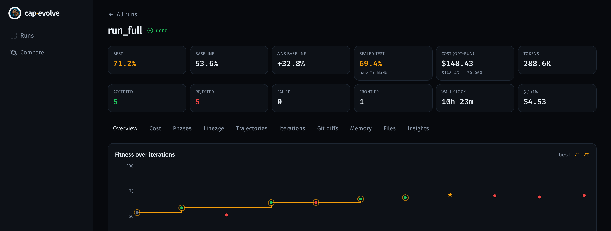
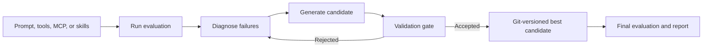

<p align="center">
  
</p>

<h1 align="center">cap-evolve</h1>

<p align="center"><em>watch capability evolve</em></p>

<p align="center">
  
  
  
  
  
</p>

**cap-evolve improves an AI agent's prompts, tools, and skills by learning from failed
evaluation traces.**

You bring the agent and the eval you already have. cap-evolve runs the loop — evaluate →
diagnose the failures → propose an edit → keep it only if it beats a held-out split by a
significant margin → commit — and reports one honest number. It optimizes what your agent
*reads*, not its weights.

<p align="center">
  
  <br/>
  <sub>A real τ²-bench airline run in the live dashboard — baseline → best, accepted vs rejected candidates, cost, and the fitness stair.</sub>
</p>

<p align="center">
  <a href="docs/GETTING_STARTED.md">Quickstart</a> ·
  <a href="#documentation">Documentation</a> ·
  <a href="#examples">Examples</a> ·
  <a href="#results">Results</a> ·
  <a href="CONTRIBUTING.md">Contributing</a>
</p>

## Why cap-evolve

- **Optimize more than prompts.** System prompts, executable **tool code**, MCP tool
  surfaces, and whole **skill packages** — pick one or several and optimize them jointly.
- **Learn from real agent failures.** Every iteration reads full trajectories and per-task
  causal feedback (which task ids a prior edit *broke* and *fixed*), so edits are large and
  don't regress the wins.
- **Keep evaluation honest.** Acceptance is a val-only significance gate (Δ > k·SE); the
  test split is sealed and scored exactly once. Both live in the core, not in editable docs.
- **Inspect every change.** Each candidate is a git commit; the dashboard shows costs,
  timing, diffs, lineage, and a tasks × iterations pass/fail heatmap.

## Try it in two minutes — no API key required

`toy_calc` is a deterministic stand-in agent that only answers correctly when its system
prompt contains a `[CALC]` marker. The `mock` optimizer adds it, so the score provably
rises — **no model is called**.

```bash
git clone https://github.com/skillberry-ai/cap-evolve.git
cd cap-evolve

python3 -m venv .venv && source .venv/bin/activate
pip install ./core                 # package: cap-evolve-core · CLI: cap-evolve · zero runtime deps

bash examples/toy_calc/run.sh
```

Expected — the seed prompt scores `0.0` on val; the optimized prompt is gate-accepted and
scores `1.0` on the sealed test split:

```text
baseline_val 0.0  ->  test_reward 1.0   (gate-accepted, test sealed) + dashboard.html
```

Open the printed `dashboard.html` in any browser. Full walkthrough:
[Getting started](docs/GETTING_STARTED.md).

## Choose your path

| Path | Use it when | Start |
|---|---|---|
| **Claude Code plugin** | You use Claude Code and want slash commands + honesty hooks | `claude --plugin-dir ./plugins/cap-evolve` then follow [`RUN.md`](RUN.md) |
| **Another coding-agent host** | Codex, Gemini, opencode, Cursor, Droid, Copilot, Kimi, Pi, Antigravity, openclaw, IBM Bob, bare | `./install.sh --host <name>` then follow [`RUN.md`](RUN.md) |
| **Manual adapter + CLI** | You want to wire the adapter yourself and drive `cap-evolve` directly | [Optimize your own agent](docs/OPTIMIZE_YOUR_OWN.md) |

Each path shares the same core install and the same honesty guarantees. Full setup,
credentials, and the optional dashboard: [Installation](docs/INSTALL.md).

## What can cap-evolve optimize?

| Capability | What the optimizer may change |
|---|---|
| **System prompts** | Rewrite / consolidate / add rules, examples, output contracts — never drop a needed rule |
| **Tool implementations** | Edit tool **code** for deterministic enforcement; add/wrap/swap tools (never bare-remove) |
| **MCP tool surfaces** | Safe edits only — tool docs, in-description examples, and which tools are exposed |
| **Skill packages** | An Agent Skill dir — `SKILL.md` bodies, references, and executable scripts |

Combine them, e.g. `[system-prompt, tools]`. See [Architecture](docs/ARCHITECTURE.md).

## Results

Numbers are cross-checked against committed run artifacts; each is labeled **fit metric**
(no holdout) or **held-out** (test scored once on ids the optimizer never saw). Full detail,
models, task/trial counts, commits, and costs: **[docs/RESULTS.md](docs/RESULTS.md)**.

| Benchmark | Split | Baseline → Optimized | Gain |
|---|---|---|---|
| **toy_calc** (zero-API) | sealed test | `0.0 → 1.0` | deterministic proof |
| **τ²-bench airline** (policy + tools) | val — *fit metric* | `0.536 → 0.712` | **+0.176 / +32.8%** |
| **τ²-bench airline**, held-out 30/10/10 | sealed **test** | `30.0 → 47.5` | **+17.5 pp / +58.3%** |
| **SkillsBench** (skill package) | sealed **test** (held-out) | `0.556 → 0.667` | **+0.111 / +20.0%** |

*Not an apples-to-apples leaderboard.* For how the held-out τ²-bench result sits next to
external tool-optimization work ([EvoTool](https://arxiv.org/abs/2603.04900) on the
original τ-Bench, and Evolutionary Context Search), with defined criteria and caveats, see
**[docs/COMPARISON.md](docs/COMPARISON.md)**.

## How it works



Each iteration receives the current best capability, its failed trajectories, per-task
impact (what previous edits broke and fixed), and the history of previous attempts. It
proposes one bold, multi-part candidate, evaluates it on val, and records whether the gate
accepted it. The pipeline is
**intake → implement-and-check → baseline → algorithm → finalize → report**; the exact
optimizer-context files, run-dir layout, and honesty guarantees are in
[Architecture](docs/ARCHITECTURE.md) and [Honest evaluation](docs/HONEST_EVAL.md).

## Use it with your own agent

Wire one small **adapter** — three required methods (plus optional hooks):

```python
tasks(split)                   -> list[Task]   # your eval cases for 'train'|'val'|'test'|'all'
run_target(task, ctx, *, seed) -> Rollout      # run your agent with the candidate LIVE as ctx
score(task, rollout)           -> Score        # reward in [0,1] + feedback (never leak the gold)
```

Everything else — splits, trials, gating, pass^k, the sealed test, memory, and the
dashboard — is provided by the core. Two ways to get there:

- **Let your coding agent build it** — open the agent you already use at the repo root and
  tell it to follow [`RUN.md`](RUN.md). It runs `intake`, asks for anything missing, writes
  the adapter, passes `cap-evolve check`, then runs the loop.
- **Do it yourself** — implement the adapter and drive the CLI.

Both are walked through in **[docs/OPTIMIZE_YOUR_OWN.md](docs/OPTIMIZE_YOUR_OWN.md)**;
the contract is in [docs/ADAPTER_CONTRACT.md](docs/ADAPTER_CONTRACT.md).

## Examples

| Example | What it shows | Needs | Run |
|---|---|---|---|
| [`toy_calc`](examples/toy_calc) | The full loop, deterministically | nothing | `bash examples/toy_calc/run.sh` |
| [`tau2_airline`](examples/tau2_airline) | Onboard a real benchmark from one prompt; optimize policy **+ tool code** | RITS creds, Claude Code | `bash examples/tau2_airline/setup.sh && bash examples/tau2_airline/run.sh` |
| [`skillsbench`](examples/skillsbench) | Optimize a **skill package**; agent runs in Docker | Docker, `uv`, Claude creds | `bash examples/skillsbench/setup.sh && bash examples/skillsbench/run.sh` |

Each example's paste-to-agent brief is its `PROMPT.md`, its narrative is `DEMO.md`, and its
committed run is under `run_full/`. See the full interactive dashboard for the tau2 run with
no backend: `cd examples/tau2_airline/run_full/ui && python3 -m http.server 8000`. Reproduce
from zero: [tau2](docs/REPRODUCE_tau2.md) · [SkillsBench](docs/REPRODUCE_skillsbench.md).

## Documentation

| Document | Use it when |
|---|---|
| [Getting started](docs/GETTING_STARTED.md) | You want your first successful run |
| [Installation](docs/INSTALL.md) | You need host-specific setup, credentials, or the dashboard |
| [Optimize your own agent](docs/OPTIMIZE_YOUR_OWN.md) | You want to integrate your agent or benchmark |
| [Adapter contract](docs/ADAPTER_CONTRACT.md) | You are implementing an adapter |
| [Architecture](docs/ARCHITECTURE.md) | You want to understand the pipeline and optimizer context |
| [Honest evaluation](docs/HONEST_EVAL.md) | You need details on splits, gates, and sealing |
| [Results](docs/RESULTS.md) | You want the full experiments and artifacts |
| [Comparison](docs/COMPARISON.md) | You want positioning vs other tools and external results |
| [Extending cap-evolve](docs/EXTENDING.md) | You are adding a capability, optimizer, or algorithm |
| [Troubleshooting](docs/TROUBLESHOOTING.md) | Installation or a run failed |
| [Roadmap](docs/ROADMAP.md) | You want planned work |
| [How-to guides](docs/how-to/cap-evolve-with-exgentic-tau2.md) | You want a specific harness + benchmark recipe |

## Project status and support

Beta (`0.x`). Contributions welcome — see [CONTRIBUTING.md](CONTRIBUTING.md) and the
[Code of Conduct](CODE_OF_CONDUCT.md). Report security issues via [SECURITY.md](SECURITY.md).
Changes are tracked in [CHANGELOG.md](CHANGELOG.md).

## Citation

```bibtex
@software{cap-evolve,
  title  = {cap-evolve: a skills-native, host-agnostic harness for honestly
            optimizing AI-agent capabilities},
  year   = {2026},
  note   = {https://github.com/skillberry-ai/cap-evolve}
}
```

**Acknowledgements.** cap-evolve includes **no third-party code** — the `gepa` and
`skillopt` skills are independent implementations of the GEPA (arXiv:2507.19457) and
SkillOpt (arXiv:2605.23904) papers, and it draws on ideas from DSPy and Anthropic's
[Agent Skills](https://www.anthropic.com/news/skills) standard. The bundled example uses
[tau2-bench](https://github.com/sierra-research/tau2-bench) (MIT). Full citations:
[docs/sources.bib](docs/sources.bib).

## License

Apache-2.0.
