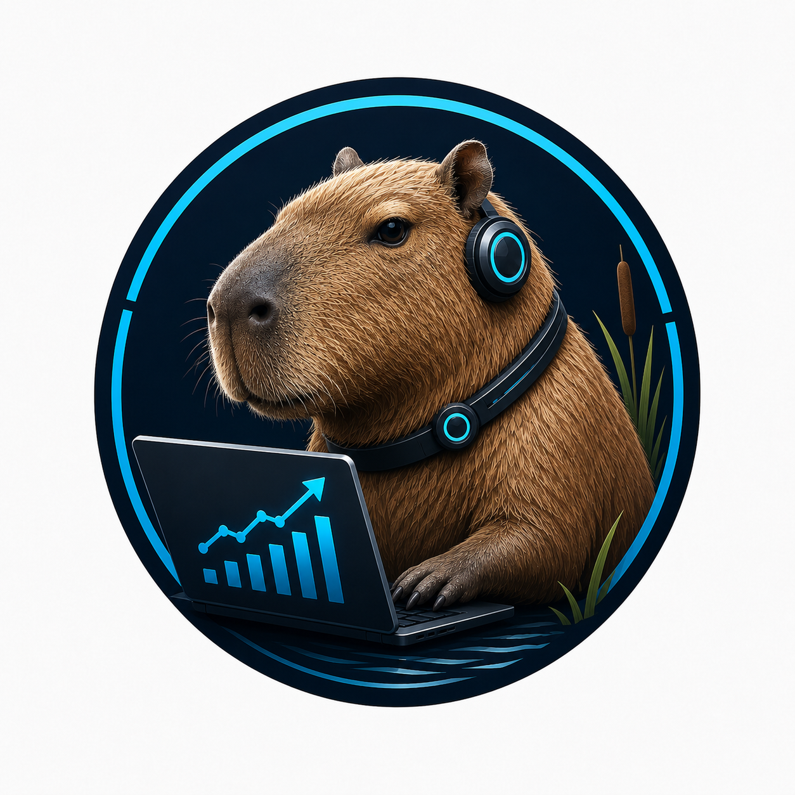
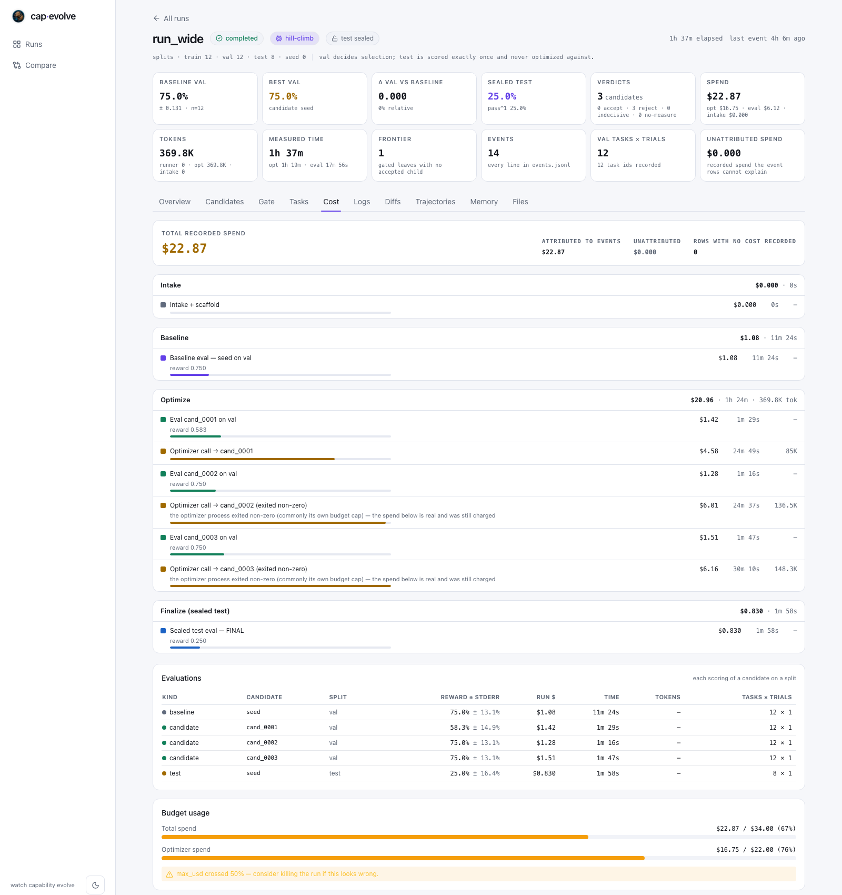
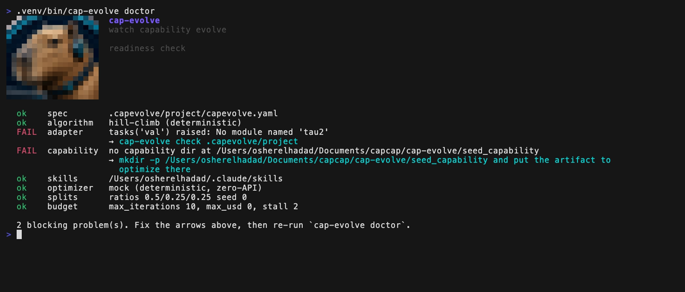
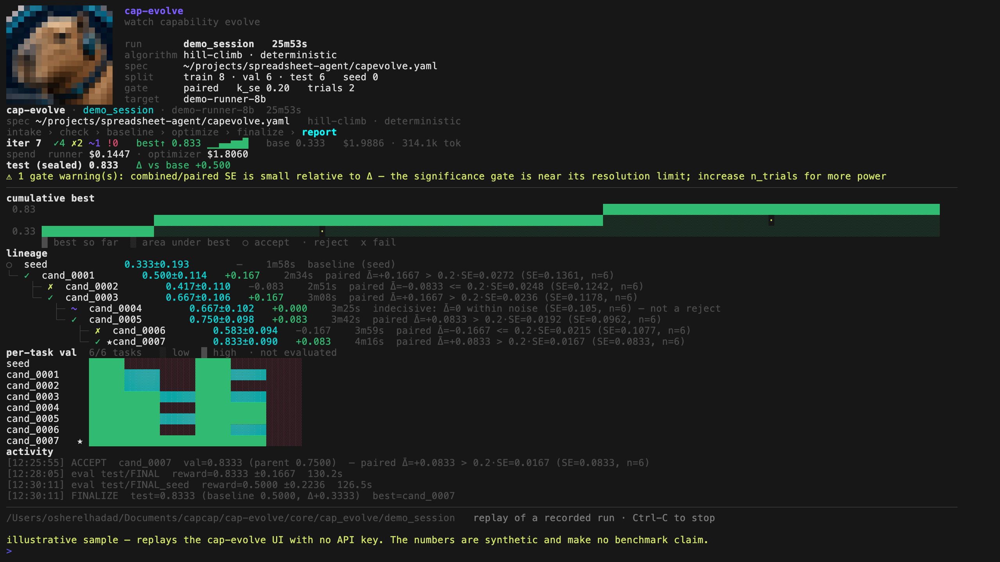
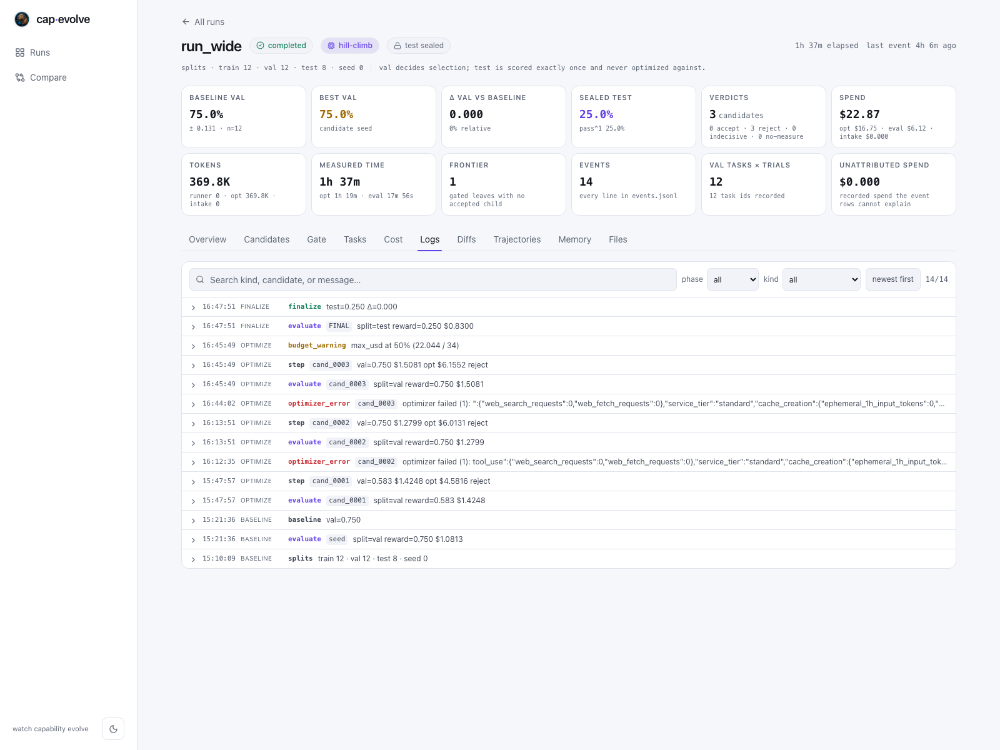
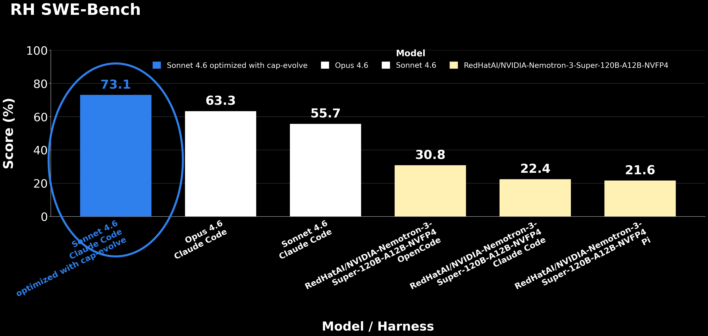
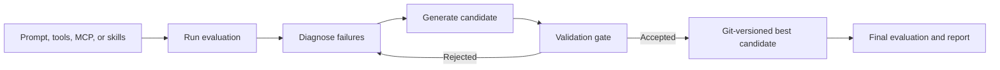

<p align="center">
  
</p>

<h1 align="center">cap-evolve</h1>

<p align="center"><em>watch capability evolve</em></p>

<p align="center">
  <a href="https://skillberry-ai.github.io/cap-evolve/"></a>
  
  
  
  
  
</p>

**cap-evolve improves an AI agent's prompts, tools, and skills by learning from failed
evaluation traces.**

You bring the agent and the eval you already have. cap-evolve runs the loop — evaluate →
diagnose the failures → propose an edit → keep it only if it beats a held-out split by a
significant margin → commit — and reports one honest number. It optimizes what your agent
*reads*, not its weights.

<p align="center">
  
  <br/>
  <sub>A real τ²-bench airline run. The cost ledger reconciles every dollar — intake, baseline,
  each optimizer call, each evaluation, the sealed test — and reports what it <em>cannot</em>
  attribute rather than hiding the gap. Budget-truncated optimizer calls are labelled as still
  charged, because they were.</sub>
</p>

<p align="center">
  <a href="docs/GETTING_STARTED.md">Quickstart</a> ·
  <a href="#documentation">Documentation</a> ·
  <a href="#examples">Examples</a> ·
  <a href="#results">Results</a> ·
  <a href="CONTRIBUTING.md">Contributing</a>
</p>

## Why cap-evolve

- **Optimize more than prompts.** System prompts, executable **tool code**, MCP tool
  surfaces, and whole **skill packages** — pick one or several and optimize them jointly.
- **Learn from real agent failures.** Every iteration reads full trajectories and per-task
  causal feedback (which task ids a prior edit *broke* and *fixed*), so edits are large and
  don't regress the wins.
- **Keep evaluation honest.** Acceptance is a val-only significance gate (Δ > k·SE); the
  test split is sealed and scored exactly once. Both live in the core, not in editable docs.
- **Inspect every change.** Each candidate is a git commit; the dashboard shows costs,
  timing, diffs, lineage, and a tasks × iterations pass/fail heatmap.

## Try it in two minutes — no API key required

`toy_calc` is a deterministic stand-in agent that only answers correctly when its system
prompt contains a `[CALC]` marker. The `mock` optimizer adds it, so the score provably
rises — **no model is called**.

```bash
git clone https://github.com/skillberry-ai/cap-evolve.git
cd cap-evolve

python3 -m venv .venv && source .venv/bin/activate
pip install ./core                 # package: cap-evolve-core · CLI: cap-evolve · zero runtime deps

bash examples/toy_calc/run.sh
```

Expected — the seed prompt scores `0.0` on val; the optimized prompt is gate-accepted and
scores `1.0` on the sealed test split:

```text
baseline_val 0.0  ->  test_reward 1.0   (gate-accepted, test sealed) + dashboard.html
```

Open the printed `dashboard.html` in any browser. Full walkthrough:
[Getting started](docs/GETTING_STARTED.md).

## The CLI

Start with no arguments — `cap-evolve` prints a branded home screen with the golden path and
every command grouped by what it's for.

```bash
cap-evolve                         # home: the 3-step path + all commands
cap-evolve init                    # scaffold a project and write capevolve.yaml
cap-evolve doctor                  # readiness check: what's missing + the command that fixes it
cap-evolve algorithms              # the five algorithms and the exact spec lines to pick one
cap-evolve help <command>          # full help with copy-paste examples
```

`doctor` is the one to run before spending anything. Every failing row names the fix:

<p align="center">
  
</p>

### See what actually changed

Every candidate is a snapshot, so you can read the edit that moved the number — unified below
120 columns, side-by-side above:

```bash
cap-evolve diff --best             # seed → the winning candidate
cap-evolve diff cand_0003          # against its parent
cap-evolve diff cand_0003 --stat   # just the per-file +/- counts
```

### Watch a run, live

```bash
cap-evolve watch                   # live view of the newest run
cap-evolve replay --demo           # no API key, no config — replays a bundled recording
cap-evolve run --tui               # the live view instead of the line log
cap-evolve watch --diff            # …and show what each accepted candidate changed
```

<p align="center">
  
  <br/>
  <sub>The live view. The masthead answers <em>is this the run I meant to launch?</em> — resolved
  spec, algorithm and mode, split sizes, gate bar. Then the cumulative-best stair, the lineage
  with the paired-gate reason behind every accept (<code>✓</code>), reject (<code>✗</code>) and
  <strong>indecisive</strong> (<code>~</code>) step, a per-task heatmap that marks
  <em>not&nbsp;evaluated</em> distinctly from <em>failed</em>, and spend split into
  runner / optimizer / intake.</sub>
</p>

Nothing there is a fabricated number: a value the run didn't record renders as `—`, an
un-evaluated task gets its own glyph rather than a zero, and **indecisive** is a first-class
outcome — it means *the measurement could not decide*, which is not the same as losing.

▶️ **[Watch the 85-second demo](docs/assets/demo/cap-evolve-demo.mp4)** — 1920×1080, 15 MB,
narrated, and captioned ([`.srt`](docs/assets/demo/cap-evolve-demo.srt)) so it still reads
**muted**. Nothing in it is a mockup. The dashboard segment crossfades four real tabs —
Overview, Candidates, **Gate**, Tasks — captured from the committed
[`run_full`](examples/tau2_airline/run_full/): baseline **53.6% → 71.2%**, 5 accepted and 5
rejected, sealed test **69.4%**. The Gate tab is the one worth pausing on: it shows every
candidate's Δ, standard error, n, and the bar it had to clear.

> One frame needs a caveat and carries it on screen: the live-view shot is
> `cap-evolve replay --demo`, a recorded session whose numbers are **synthetic** and make no
> benchmark claim — it exists to show the UI with no API key. Every *measured* figure in the
> video is in [Results](docs/RESULTS.md), and RH-SWE-bench is labelled on screen as a fit
> metric with **no committed artifact**, because that is what it is.

`watch` and `replay` render the same projection the dashboard does (`events.jsonl` →
`reduce_run`), so the terminal and the browser can never disagree about what happened.
Piped or non-TTY output falls back to a plain line log, and `run --tui` leaves stdout
byte-identical so scripts can still parse it as JSON.

## The dashboard

```bash
cap-evolve dashboard                        # live, over a base dir of runs
```

Every run gets the same tabs whatever algorithm produced it — Overview, Candidates, Gate,
Tasks, Cost, Logs, Diffs, Trajectories, Memory, Files — and an algorithm that has extra signal
gets an extra tab rather than a different dashboard. GEPA's minibatch-vs-full-val gates and
Pareto selection, SkillOpt's epochs and edit-budget schedule, evograph's weakness graph, and
`agent-optimize`'s free-form rounds are all read from events the engine already emitted.

<p align="center">
  
  <br/>
  <sub>Logs: every line of <code>events.jsonl</code>, phase-tagged and filterable — including the
  optimizer's own stderr and each budget warning. Model- and subprocess-authored text is
  sanitized and rendered as text nodes only, so a log line can never drive the page.</sub>
</p>

The dashboard and the terminal are the same projection (`events.jsonl` → `reduce_run`), so they
cannot disagree about what happened. `run` also writes a self-contained `dashboard.html` that
needs no server.

## Evaluate in parallel

The tasks × trials grid is embarrassingly parallel. Opt in per run:

```yaml
algorithm_args: "--workers 8"
```

Measured on one machine, 16 tasks × 2 trials
([`scripts/demo-video/par_demo.py`](scripts/demo-video/par_demo.py)):

| workers | wallclock | speedup | `SplitResult` |
|--:|--:|--:|---|
| 1 | 6.60 s | — | reference |
| 4 | 1.69 s | 3.9× | identical |
| 8 | 0.84 s | 7.9× | identical |

The identity column is the point: parallelism may change the wallclock and nothing else,
so `par_demo.py` exits non-zero if any statistic diverges. The default is `workers=1`, so
every published result stays reproducible.

## Choose your path

| Path | Use it when | Start |
|---|---|---|
| **Claude Code plugin** | You use Claude Code and want slash commands + honesty hooks | `claude --plugin-dir ./plugins/cap-evolve` then follow [`RUN.md`](RUN.md) |
| **Another coding-agent host** | Codex, Gemini, opencode, Cursor, Droid, Copilot, Kimi, Pi, Antigravity, openclaw, IBM Bob, bare | `./install.sh --host <name>` then follow [`RUN.md`](RUN.md) |
| **Manual adapter + CLI** | You want to wire the adapter yourself and drive `cap-evolve` directly | [Optimize your own agent](docs/OPTIMIZE_YOUR_OWN.md) |

Each path shares the same core install and the same honesty guarantees. Full setup,
credentials, and the optional dashboard: [Installation](docs/INSTALL.md).

## What can cap-evolve optimize?

| Capability | What the optimizer may change |
|---|---|
| **System prompts** | Rewrite / consolidate / add rules, examples, output contracts — never drop a needed rule |
| **Tool implementations** | Edit tool **code** for deterministic enforcement; add/wrap/swap tools (never bare-remove) |
| **MCP tool surfaces** | Safe edits only — tool docs, in-description examples, and which tools are exposed |
| **Skill packages** | An Agent Skill dir — `SKILL.md` bodies, references, and executable scripts |

Combine them, e.g. `[system-prompt, tools]`. See [Architecture](docs/ARCHITECTURE.md).

## Results

Each result is labeled **fit metric** (no holdout) or **held-out** (test scored once on ids
the optimizer never saw). Full detail, models, task/trial counts, commits, and costs:
**[docs/RESULTS.md](docs/RESULTS.md)**. Every row is cross-checked against a committed run
artifact **except RH-SWE-bench**, whose artifact is not in this repo — see the caveats in
[docs/RESULTS.md](docs/RESULTS.md#rh-swe-bench-swe-bench-verified-via-harbor-fit-metric-no-committed-artifact)
before quoting it.

| Benchmark | Split | Baseline → Optimized | Gain |
|---|---|---|---|
| **RH-SWE-bench** (skill-package + system-prompt, Harbor) | val — *fit metric* (119 tasks) | `0.580 → 0.765` | **+0.185 / +31.9%** |
| **toy_calc** (zero-API) | sealed test | `0.0 → 1.0` | deterministic proof |
| **τ²-bench airline** (policy + tools) | val — *fit metric* | `0.536 → 0.712` | **+0.176 / +32.8%** |
| **τ²-bench airline**, held-out 30(=val)/20 | sealed **test** | `30.0 → 47.5` | **+17.5 pp / +58.3%** |
| **SkillsBench** (skill package) | sealed **test** (held-out) | `0.556 → 0.667` | **+0.111 / +20.0%** |

<p align="center">
  
  <br/>
  <sub>RH SWE-Bench by model and harness: a cap-evolve-optimized Sonnet 4.6 (73.1) scores
  above an unoptimized Opus 4.6 (63.3) and its own unoptimized baseline (55.7).
  <br/>
  <em>This chart's numbers are a different measurement from the 58.0 → 76.5 fit-metric run in
  the table above, and the relationship between the two is unresolved — see
  <a href="docs/RESULTS.md#rh-swe-bench-swe-bench-verified-via-harbor-fit-metric-no-committed-artifact">the caveats</a>.</em></sub>
</p>

**At a glance — baseline → optimized across all benchmarks:**

```
reward × 100
─────────────────────────────────────────────────────────────────────
RH-SWE-bench (119 tasks, fit metric)    ●────────────●  58.0 → 76.5  +18.5 pp / +31.9%
τ²-bench airline (50 tasks, fit metric) ●──────────●    53.6 → 71.2  +17.6 pp / +32.8%
τ²-bench airline (20 tasks, held-out)   ●──────────●    30.0 → 47.5  +17.5 pp / +58.3%
SkillsBench (3 tasks, held-out)         ●──────●        55.6 → 66.7  +11.1 pp / +20.0%
─────────────────────────────────────────────────────────────────────
○ = baseline (seed)   ● = optimized (best candidate)
```

*Not an apples-to-apples leaderboard.* For how the held-out τ²-bench result sits next to
external tool-optimization work ([EvoTool](https://arxiv.org/abs/2603.04900) on the
original τ-Bench, and Evolutionary Context Search), with defined criteria and caveats, see
**[docs/COMPARISON.md](docs/COMPARISON.md)**.

## How it works


```mermaid
flowchart LR
    A[Prompt, tools, MCP, or skills] --> B[Run evaluation]
    B --> C[Diagnose failures]
    C --> D[Generate candidate]
    D --> E[Validation gate]
    E -->|Accepted| F[Git-versioned best candidate]
    E -->|Rejected| C
    F --> G[Final evaluation and report]
```

Each iteration receives the current best capability, its failed trajectories, per-task
impact (what previous edits broke and fixed), and the history of previous attempts. It
proposes one bold, multi-part candidate, evaluates it on val, and records whether the gate
accepted it. The pipeline is
**intake → implement-and-check → baseline → algorithm → finalize → report**; the exact
optimizer-context files, run-dir layout, and honesty guarantees are in
[Architecture](docs/ARCHITECTURE.md) and [Honest evaluation](docs/HONEST_EVAL.md).

## Use it with your own agent

Wire one small **adapter** — three required methods (plus optional hooks):

```python
tasks(split)                   -> list[Task]   # your eval cases for 'train'|'val'|'test'|'all'
run_target(task, ctx, *, seed) -> Rollout      # run your agent with the candidate LIVE as ctx
score(task, rollout)           -> Score        # reward in [0,1] + feedback (never leak the gold)
```

Everything else — splits, trials, gating, pass^k, the sealed test, memory, and the
dashboard — is provided by the core. Two ways to get there:

- **Let your coding agent build it** — open the agent you already use at the repo root and
  tell it to follow [`RUN.md`](RUN.md). It runs `intake`, asks for anything missing, writes
  the adapter, passes `cap-evolve check`, then runs the loop.
- **Do it yourself** — implement the adapter and drive the CLI.

Both are walked through in **[docs/OPTIMIZE_YOUR_OWN.md](docs/OPTIMIZE_YOUR_OWN.md)**;
the contract is in [docs/ADAPTER_CONTRACT.md](docs/ADAPTER_CONTRACT.md). For common
cases, **don't write an adapter from scratch** — copy a ready-made
[adapter template](templates/adapters/) (JSONL, HuggingFace, tau2-bench, SWE-bench,
SkillsBench) and switch providers with a one-line env change:
[docs/ADAPTER_TEMPLATES.md](docs/ADAPTER_TEMPLATES.md).

## Examples

| Example | What it shows | Needs | Run |
|---|---|---|---|
| [`toy_calc`](examples/toy_calc) | The full loop, deterministically | nothing | `bash examples/toy_calc/run.sh` |
| [`tau2_airline`](examples/tau2_airline) | Onboard a real benchmark from one prompt; optimize policy **+ tool code** | RITS creds, Claude Code | `bash examples/tau2_airline/setup.sh && bash examples/tau2_airline/run.sh` |
| [`skillsbench`](examples/skillsbench) | Optimize a **skill package**; agent runs in Docker | Docker, `uv`, Claude creds | `bash examples/skillsbench/setup.sh && bash examples/skillsbench/run.sh` |

Each example's paste-to-agent brief is its `PROMPT.md`, its narrative is `DEMO.md`, and its
committed run is under `run_full/`. See the full interactive dashboard for the tau2 run with
no backend: `cd examples/tau2_airline/run_full/ui && python3 -m http.server 8000`. Reproduce
from zero: [tau2](docs/REPRODUCE_tau2.md) · [SkillsBench](docs/REPRODUCE_skillsbench.md).

## Documentation

| Document | Use it when |
|---|---|
| [Site (home)](https://skillberry-ai.github.io/cap-evolve/) | You want the interactive site — hero, results, and doc navigation in one place |
| [Getting started](docs/GETTING_STARTED.md) | You want your first successful run |
| [Installation](docs/INSTALL.md) | You need host-specific setup, credentials, or the dashboard |
| [Optimize your own agent](docs/OPTIMIZE_YOUR_OWN.md) | You want to integrate your agent or benchmark |
| [Adapter templates](docs/ADAPTER_TEMPLATES.md) | You want a copy-and-run adapter (JSONL, HuggingFace, tau2, SWE-bench, SkillsBench) |
| [Adapter contract](docs/ADAPTER_CONTRACT.md) | You are implementing an adapter |
| [Architecture](docs/ARCHITECTURE.md) | You want to understand the pipeline and optimizer context |
| [Agent orchestration](docs/AGENT_ORCHESTRATION.md) | You want the agent to drive the loop itself (`orchestration_mode: agent`, `agent-optimize`) |
| [Honest evaluation](docs/HONEST_EVAL.md) | You need details on splits, gates, and sealing |
| [Results](docs/RESULTS.md) | You want the full experiments and artifacts |
| [Comparison](docs/COMPARISON.md) | You want positioning vs other tools and external results |
| [Extending cap-evolve](docs/EXTENDING.md) | You are adding a capability, optimizer, or algorithm |
| [Troubleshooting](docs/TROUBLESHOOTING.md) | Installation or a run failed |
| [Roadmap](docs/ROADMAP.md) | You want planned work |
| [How-to guides](docs/how-to/cap-evolve-with-exgentic-tau2.md) | You want a specific harness + benchmark recipe |

## Project status and support

Beta (`0.x`). Contributions welcome — see [CONTRIBUTING.md](CONTRIBUTING.md) and the
[Code of Conduct](CODE_OF_CONDUCT.md). Report security issues via [SECURITY.md](SECURITY.md).
Changes are tracked in [CHANGELOG.md](CHANGELOG.md).

## Citation

```bibtex
@software{cap-evolve,
  title  = {cap-evolve: a skills-native, host-agnostic harness for honestly
            optimizing AI-agent capabilities},
  year   = {2026},
  note   = {https://github.com/skillberry-ai/cap-evolve}
}
```

**Acknowledgements.** cap-evolve includes **no third-party code** — the `gepa` and
`skillopt` skills are independent implementations of the GEPA (arXiv:2507.19457) and
SkillOpt (arXiv:2605.23904) papers, and it draws on ideas from DSPy and Anthropic's
[Agent Skills](https://www.anthropic.com/news/skills) standard. The bundled example uses
[tau2-bench](https://github.com/sierra-research/tau2-bench) (MIT). Full citations:
[docs/sources.bib](docs/sources.bib).

## License

Apache-2.0.
