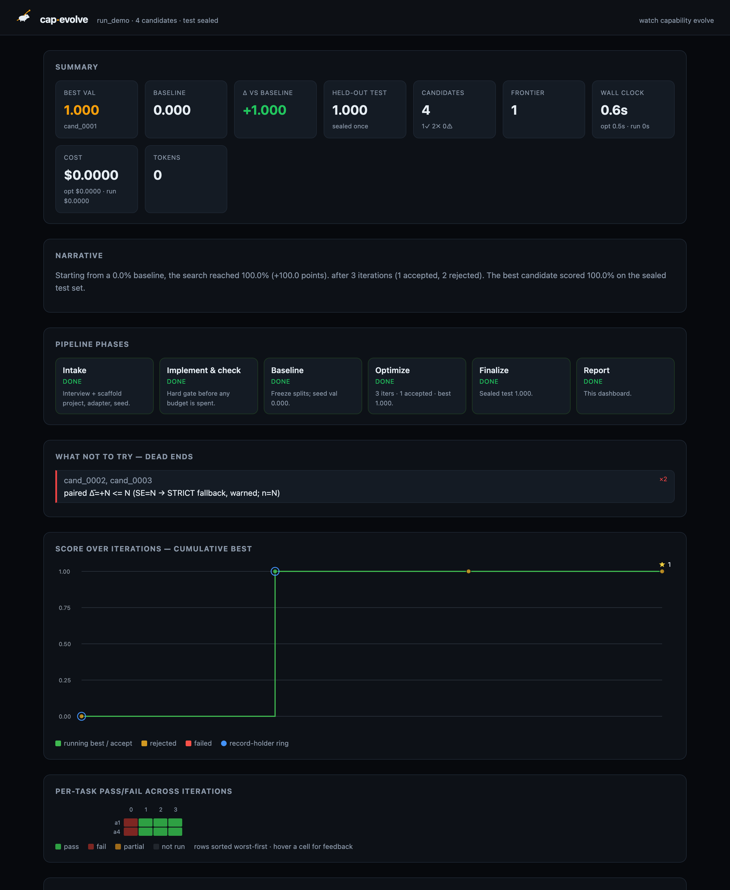

# Getting started

Your first successful cap-evolve run, in two minutes, with **no API key**.

## Prerequisites
- Python **3.10+** and **git**.

## 1. Clone and enter

```bash
git clone https://github.com/skillberry-ai/cap-evolve.git
cd cap-evolve
```

## 2. Create a clean environment and install the core

```bash
python3 -m venv .venv && source .venv/bin/activate
pip install ./core          # package: cap-evolve-core, CLI: cap-evolve (zero runtime deps)
cap-evolve version          # verify
cap-evolve doctor           # diagnose the install (non-zero exit on a hard failure)
```

> If your default pip index requires auth, append `--index-url https://pypi.org/simple`.
> If anything above fails, `cap-evolve doctor` names the cause and the fix — see
> [`TROUBLESHOOTING.md`](TROUBLESHOOTING.md).

## 3. Run the zero-API toy example

`toy_calc` is a deterministic stand-in agent that only answers correctly when its system
prompt contains a `[CALC]` marker. The `mock` optimizer adds the marker, so the score
provably rises — **no model is called**.

```bash
bash examples/toy_calc/run.sh
```

The seed prompt scores `0.0` on val; the optimized prompt is gate-accepted and scores
`1.0` on the sealed test split. Below is real output of the command above, captured on a
box **without** the optional live-server backend installed. Every metric line is
deterministic — you will get those bytes exactly. The only additions are the three
`# ← varies` markers, flagging the lines that legitimately differ per environment:

```text
Working directory: /var/folders/zh/srgnbq_97qvb6002zsr40tgc0000gn/T/toy_calc.XXXXXX.9t5qIAzQje   # ← varies (mktemp)
{"dashboard": "skipped", "reason": "capevolve-dashboard not installed (pip install -e dashboard/backend)"}   # ← varies
{
  "run_dir": ".capevolve/run_demo",
  "best_id": "cand_0001",
  "baseline_val": 0.0,
  "test_reward": 1.0,
  "test_baseline_reward": 0.0,
  "test_delta": 1.0,
  "test_pass_k": {
    "1": 1.0,
    "2": 0.0
  },
  "iterations": 3,
  "dashboard": ".capevolve/run_demo/dashboard.html",
  "dashboard_server": "skipped"   # ← varies
}
```

If you *did* install the optional backend (`pip install -e dashboard/backend`, as
[`INSTALL.md`](INSTALL.md) suggests), those two lines instead read
`{"dashboard": "http://127.0.0.1:7878"}` and `"dashboard_server": "http://127.0.0.1:78xx"`.
Either way the self-contained `dashboard.html` is written — `"skipped"` refers only to the
*optional live server*, never to the dashboard itself.

`test_pass_k` `"2": 0.0` is honest too, and it is **not** about the number of tasks:
pass^k is computed per task over that task's *trials*, then averaged. The toy runs
`num_trials: 1`, so `k=2` exceeds the one trial available and the estimator returns 0
rather than guessing. Re-run with `num_trials: 2` or more to populate it. (Once
[PR #187](https://github.com/skillberry-ai/cap-evolve/pull/187) — issue #112 — lands, an
unmeasurable `k` is **omitted** instead of reported as `0.0`, so the `"2"` key simply
disappears from this block. Same fact, better rendering.)

This is exactly what `core/tests/test_e2e_slice.py` asserts. Open the `dashboard.html`
under the printed working directory in any browser:



That screenshot is **this** run, not a dressed-up substitute: `$0.0000` / `0` tokens
because no model is called, and exactly 2 tasks × 4 candidates because that is all
`toy_calc` has. A real benchmark run fills the same panels out far further — see
[`RESULTS.md`](RESULTS.md).

## 4. Where to next

| You want to… | Go to |
|---|---|
| Understand what cap-evolve optimizes and how | [`../README.md`](../README.md) · [`ARCHITECTURE.md`](ARCHITECTURE.md) |
| Set up a real optimizer/runner (credentials, dashboard) | [`INSTALL.md`](INSTALL.md) |
| Optimize your own agent + benchmark | [`OPTIMIZE_YOUR_OWN.md`](OPTIMIZE_YOUR_OWN.md) |
| See real benchmark results | [`RESULTS.md`](RESULTS.md) |
| Something failed | [`TROUBLESHOOTING.md`](TROUBLESHOOTING.md) |
